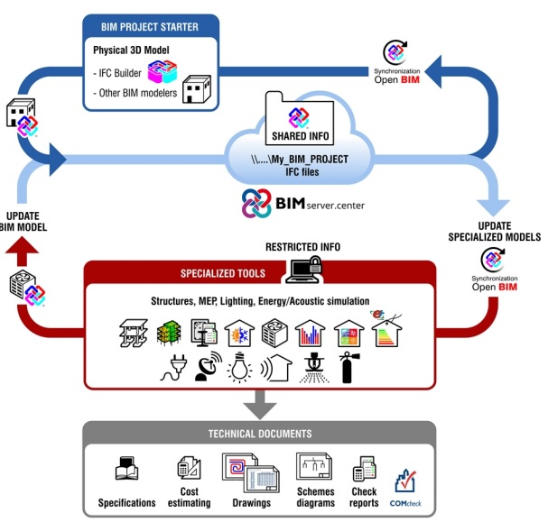

# BIM-Modeling
Modelagem 3D e ferramentas de software BIM para arquitetura

# 3D_BIM

Modelagem 3D e ferramentas de software BIM para arquitetura

Modelagem 3D/BIM utilizando software Autodesk Revit e Freecad (open source).

## [FREECAD](https://www.freecadweb.org/)

- Tutoriais

[Barcelona pavilion - Yorik van Havre](https://www.youtube.com/playlist?list=PLmKdGVtV5VnuE5U75CEORkjlVK_nzQQUh) - 1/17

[BIM with FreeCAD - Yorik van Havre](https://www.youtube.com/playlist?list=PLmKdGVtV5Vnt2cj4IZIv9FM39QHaE1ZaU) - 1/27

[Complete house project tutorial for architect 'from zero to hero' using freeCAD - freeCAD for Architecture](https://www.youtube.com/watch?v=RcX0-IArnzo&list=PLwA6cJhCSx1M8BGm9eZ_hZFvz48u8YCFl) - 1/22

[Tips and trick for better and fastest workflow in freeCAD - freeCAD for Architecture](https://www.youtube.com/playlist?list=PLwA6cJhCSx1P1erikDHTa6C9t2CweQaz-) 1/8

[UH Studio Design Academy](https://www.youtube.com/watch?v=9EzxiwjKzTQ&list=PLJThqQUeIsPTw-SQeY595Kpz_xQeZxz4o) - 1/7

[FreeCad - Rafael García Rodríguez](PLvDOxR8gzkX_3LtuEKBIoNLFFgJK_AXkE) - 1/17

[FreeCAD Lessons for Beginners - Learn FreeCAD](https://www.youtube.com/playlist?list=PL6fZ68Cq3L8k0JhxnIVjZQN26cn9idJrj) - 1/13

- Tutoriais Freecad + Python

[Python scripting tutorial](https://www.freecadweb.org/wiki/index.php?title=Introduction_to_Python) - forum freecadweb

[Scripting examples](https://www.freecadweb.org/wiki/index.php?title=Scripting_examples) - forum freecadweb

## [BLENDER BIM](https://blenderbim.org/)

- Tutoriais

[BlenderBIM beginners tutorial: my first BIM project](https://blenderbim.org/blenderbim-tutorial.html) - 1/1

## [REVIT](https://www.autodesk.com/products/revit/overview)

- Tutoriais

[Revit: Viabilidade e Estudo Preliminar de Complexo Multiuso - Roberta Vendramini](https://www.youtube.com/playlist?list=PL9t0ZaF1phAV3UH9aZofSmkT5cDY24tPr) - 1/105

[Revit 2017: Modelagem de Edifício Residencial + Planta Humanizada - Roberta Vendramini](https://www.youtube.com/playlist?list=PL9t0ZaF1phAW-p-J4vXmFNjb2dXmeTz8P) - 1/181

- Tutoriais Revit + Python

[Python for Revit Course - pyRevit](https://www.youtube.com/playlist?list=PLc_1PNcpnV5742XyF8z7xyL9OF8XJNYnv) - 1/9

[Python nodes](https://primer.dynamobim.org/10_Custom-Nodes/10-4_Python.html)

## [IFC BUILDER](http://ifc-builder.en.cype.com/)

- Tutoriais

[Introdução ao Open BIM com IFC Builder](https://www.udemy.com/course/openbim-ifcbuilder/) - 1/23

###### (ifc builder, 2020)

## [DYNAMO BIM](https://dynamobim.org/)

- Tutoriais

[Checagem de áreas de janelas em função das áreas dos ambientes](https://knowledge.autodesk.com/pt-br/support/revit-products/learn-explore/caas/simplecontent/content/checagem-de--C3-A1reas-de-janelas-em-fun-C3-A7-C3-A3o-das--C3-A1reas-dos-ambientes-com-o-dynamo.html?fbclid=IwAR1c1EpfLA6GxJtN79P4g3Zce-IS6kIgiT26VwYQFp_XVRPGTFYUr7M_42w) - 1/1

- Tutoriais Dynamo + Python

## FERRAMENTA DE OTIMIZAÇÃO PARA BIM

1. [Optimo](https://github.com/renatogcruz/Evolutionary-computing/tree/master/optimo_optimization_revit)

O Optimo é uma ferramenta de otimização multiobjetivos BPOpt (*Performance Optimization*) baseada em BIM para Dynamo. O Optimo foi desenvolvido com base no código-fonte aberto jmetal.NET, criado originalmente por Antonio J. Nebro.
