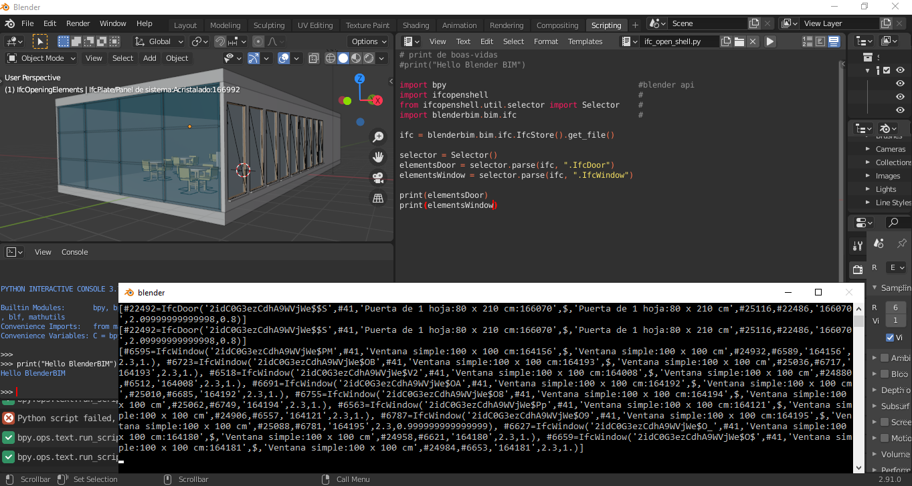

## [BLENDER BIM](https://blenderbim.org/)

- Tutoriais

Breve introdução ao Blender Bim

Link [Youtube](https://www.youtube.com/watch?v=AH4o5CzBV5Y) - 1/1

[Arquivo IFC](https://drive.google.com/drive/folders/1wXLaf1wPaWzfEwWzu7kNTdJoOUqU6K0E) utilizado by Antonio Gonzalez Viegas



### Console do Blender BIM

PYTHON INTERACTIVE CONSOLE 3.7.7 (default, Jun 13 2020, 11:11:23) [MSC v.1916 64 bit (AMD64)]

Builtin Modules:       bpy, bpy.data, bpy.ops, bpy.props, bpy.types, bpy.context, bpy.utils, bgl, blf, mathutils
Convenience Imports:   from mathutils import *; from math import *
Convenience Variables: C = bpy.context, D = bpy.data

código

```
>>> print("Hello BlenderBIM")
Hello BlenderBIM

>>> bpy.data.objects
<bpy_collection[139], BlendDataObjects>

>>> bpy.data.objects[10]
bpy.data.objects['IfcFurnishingElement/M_Chair-Breuer:M_Chair-Breuer:165479']

>>>  bpy.data.objects[10].                                                    # tab para ver as funções disponíveis
```


 


output:

```
BIMAttributeProperties
                          
BIMClassificationReferenceProperties
                          
BIMObjectConstraintProperties
                          
[...]
                          
values(

vertex_groups
                          
visible_get(
                          
visible_in_viewport_get(
```
                    


```
>>> bpy.data.objects[10].BIMObjectProperties.items()
```

output:

```
[('ifc_definition_id', 18799), ('relating_structure', <bpy id prop: owner="OBIfcFurnishingElement/M_Chair-Breuer:M_Chair-Breuer:165479", name="relating_structure", address=0x0000028CDF0277E8>), ('boundary_condition', <bpy id prop: owner="OBIfcFurnishingElement/M_Chair-Breuer:M_Chair-Breuer:165479", name="boundary_condition", address=0x0000028CDF028D48>), ('relating_object', <bpy id prop: owner="OBIfcFurnishingElement/M_Chair-Breuer:M_Chair-Breuer:165479", name="relating_object", address=0x0000028CDF029648>), ('relating_type', <bpy id prop: owner="OBIfcFurnishingElement/M_Chair-Breuer:M_Chair-Breuer:165479", name="relating_type", address=0x0000028CDF029F48>), ('structural_member_connection', <bpy id prop: owner="OBIfcFurnishingElement/M_Chair-Breuer:M_Chair-Breuer:165479", name="structural_member_connection", address=0x0000028CDF028DD8>)]
```

  

### Scripting ifc_open_shell.py


```
import bpy                                         #blender api
import ifcopenshell                                #
from ifcopenshell.util.selector import Selector    #
import blenderbim.bim.ifc                          #

ifc = blenderbim.bim.ifc.IfcStore().get_file()

selector = Selector()
door = selector.parse(ifc, ".IfcDoor")             # seleciona os elementos "Door"
window = selector.parse(ifc, ".IfcWindow")         # seleciona os elementos "Window"
column = selector.parse(ifc, ".IfcColumn")         # seleciona os elementos "Column"

print(door)                                        # retorna lista de elementos
print(window)                                      # retorma lista de elementos
print(column)                                      # retorna lista vazia (não há colunas)

# percorrendo o globalID do elemento "Window"
list = []

if len(window) > 0:
    for element in door:
        list.append(element.GlobalId)
    for obj in bpy.data.objects:
        try:
            if obj.BIMObjectProperties.attributes[0].string.value in list:
                obj.hide_set(False)            
            else:
                obj.hide_set(True)            
           
        
        except:
            print("Objeto sem Global ID.")

print(list)
```


